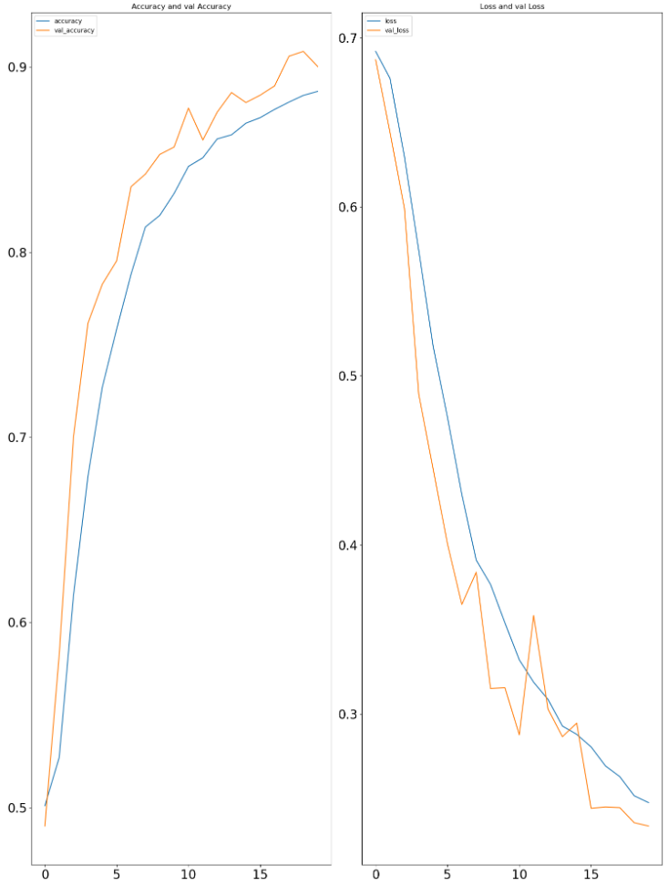
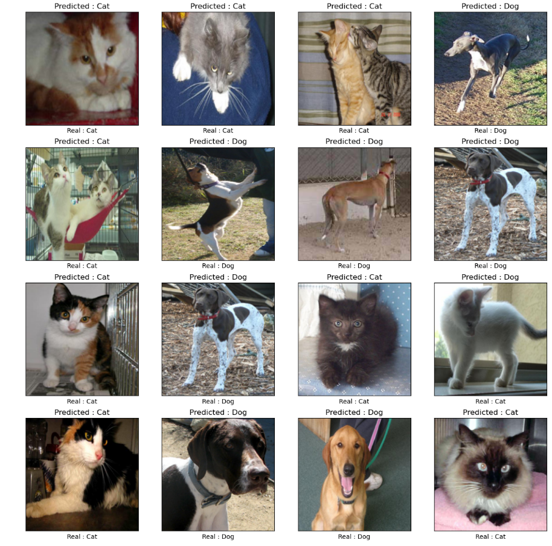

# Cats and dogs classification using CNN

This project focuses on recognizing cat or dog in the picture using CNN model. The model has been trained on a dataset from Kaggle.com
Dataset has been pre-prepared by changing filenames to "label.filename.ext". Label contains 0 or 1 depending on whether the photo shows cat - 0 or dog - 1. 

https://www.kaggle.com/datasets/shaunthesheep/microsoft-catsvsdogs-dataset  - Link to the dataset.

## CNN Model

This convolutional neural network (CNN) model contains: 

- data_augmentation - input layer
- 5 convolutional layers, each followed max pooling 
- 1 output layer with 'linear' activation, whose result is used for 'sigmoid' function to calculate prediction.

## Results 

